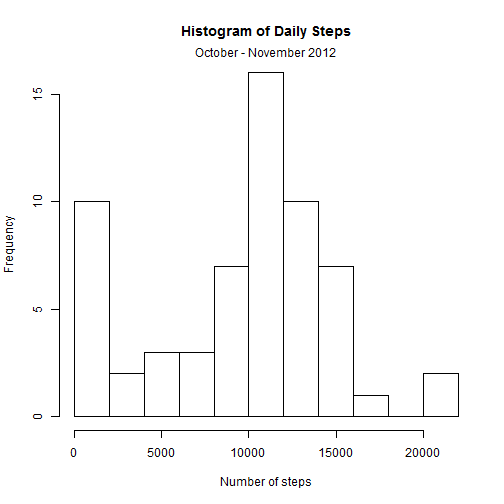
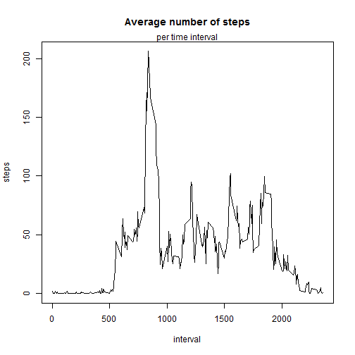
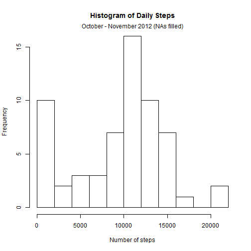
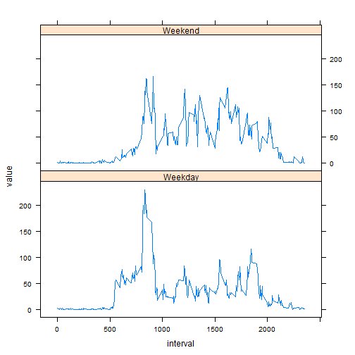

Here, I'm setting my working dirctory, loading necessary libraries
and loading the 'activity' dataset

```r
library(reshape2)
library(lattice)
setwd("C:/Users/jroberti/JohnsHopkinsDataScience/reproducibleResearch/")
data<-read.csv("activity.csv",stringsAsFactors=FALSE)
```

###PART 1
For Part 1 of the analysis we are concerned with quantifying and displaying simple statistics and trends of the dataset.  It should be noted that missing values are ignored for Parts 1 & 2 of the analysis

To calculate the mean total number of steps taken per day, I entered the following:

```r
#reshapes the dataframe into a very tall and skinny dataframe  
dataMelt<-melt(data,id=c("date","interval"), measure.vars="steps")
#return the sum of steps for each day:
dailySteps<-dcast(dataMelt,date~variable, sum,na.rm=TRUE)
```

Next, I plotted a histogram of the total of steps taken per day:

```r
#create a histogram of steps taken per day
hist(dailySteps$steps,main= "Histogram of Daily Steps", xlab="Number of steps",breaks=10)
mtext("October - November 2012")
```

 

Then I quantified the mean and median of the total number of steps taken each day:

```r
#calculate the mean and median total number of steps taken each day:
#mean
meanDaily<-mean(dailySteps$steps,na.rm=TRUE)
#median
medianDaily<-median(dailySteps$steps,na.rm=TRUE)
```
The mean number of steps taken each day was: 9354.2295082.  
The median number of steps taken each day was: 10395.  

###PART 2
For part two of the analysis we take a more detailed look at the interval periods

I've created a time-series plot of the the average number of steps taken per each 5-minute interval:

```r
#dcast data to find average number of steps taken per interval
meanStepsPerInterval<-dcast(dataMelt,interval~variable,mean,na.rm=TRUE)
#make a time-series plot of this
with(meanStepsPerInterval,plot(interval,steps,type="l",main="Average number of steps"))
mtext("per time interval")
```

 

We are also interested in determining which 5-minute interval on average contains the maximum number of steps:

```r
#Which 5-minute interval, on average across all the days in the dataset, contains the maximum number of steps?
maxInterval<-which.max(meanStepsPerInterval$steps)
meanStepsPerInterval$interval[maxInterval]
```

```
## [1] 835
```

###PART 3
This part of the analysis covers the same concepts as parts 1 and 2, but missing values are filled in.

First we would like to know how many rows of missing data there are in the dataset:

```r
#rid dataset of NAs
cleanData<-data[complete.cases(data),]
#quantify the total number of rows with missing data
NA_Rows<-nrow(data)-nrow(cleanData)
```

Next, we want to fill in the NA values with something meaningful.  I've decided to fill in the missing values of 'Steps' with the mean value of the respective 5-minute interval:

```r
#create a new dataset that is equal to the original dataset but with missing values filled in:
#using the mean interval value for the interval in question to replace NA values
mergedData<-merge(dataMelt,meanStepsPerInterval,by="interval")
for(i in 1:nrow(mergedData)){
    if(is.na(mergedData$value[i])==TRUE){
        mergedData$value[i]<-mergedData$steps[i]
    }
}
```

Now that the new dataset is generated, we wish to calculate the total number of steps taken each day and also wish to make a histogram of this:

```r
#returns the sum of steps for each day:
dailyStepsFill<-dcast(mergedData,date~variable,sum)
#round to nearest whole number (can't have fractional steps):
dailyStepsFill$steps<-round(dailyStepsFill$steps)
#create a histogram of steps taken per day (NAs are filled in for this dataset)
hist(dailySteps$steps,main= "Histogram of Daily Steps", xlab="Number of steps",breaks=10)
mtext("October - November 2012 (NAs filled)")
```

 

Lastly, we wish to quantify the mean and median total number of steps taken per day:

```r
#calculate and return the mean:
meanDailyFill<-mean(dailyStepsFill$steps)
#calculate and return the median:
medianDailyFill<-median(dailyStepsFill$steps)
```
The mean number of steps taken each day with was: 1.0766164 &times; 10<sup>4</sup>.  
The median number of steps taken each day was: 1.0766 &times; 10<sup>4</sup>.  

The mean and median values of this dataset are closer to one another than the mean and median values of the clean dataset.  This is because I used the mean interval values of the clean dataset to fill in the NA values of the original dataset.  This forces the new mean and median daily step values to converge towards one another.  

###PART 4
For part 4 we wish to create a new factor that discerns whether the steps were recorded on a weekday or a weekend.  First we need to convert the 'date' column into a POSIX time format:

```r
#convert 'date' variable of merged dataset (i.e., mergedData) to POSIX
mergedData$POSIX<-as.POSIXct(mergedData$date, format =('%Y-%m-%d'), tz = "UTC")
mergedData$day<-weekdays(mergedData$POSIX)
```

Next, we wish to classify the time interval as either 'weekend' or 'weekday'

```r
#classify day as weekend or weekday:
for(i in 1:nrow(mergedData)){
    ifelse(mergedData$day[i]=="Sunday" | mergedData$day[i]=="Saturday",
        mergedData$dayType[i]<-"Weekend",mergedData$dayType[i]<-"Weekday") 
}
```

Third, we must transform the dataset so that the factors 

```r
#transform the dataset using weekday type as the factor
mergedData<-transform(mergedData, dayType=factor(dayType))
#reformat the dataframe
dataMelt2<-melt(mergedData,id=c("interval","dayType"), measure.vars="value")
```

Fourth, we quantify the mean steps taken per interval AND day type (e.g., weekend vs weekday)

```r
meanStepsPerDayType_Int<-dcast(dataMelt2,interval+dayType~variable,mean)
```

Lastly, we create a time-series of the 5-minute intervals for weekends and weekdays:  

```r
#Make a panel plot containing a time series plot of the 5-minute interval (x-axis) 
#and the number of steps taken, averaged across all weekdays or weekend days (y-axis).
xyplot(value~interval|dayType,data=meanStepsPerDayType_Int,layout=c(1,2),type="l")
```

 
